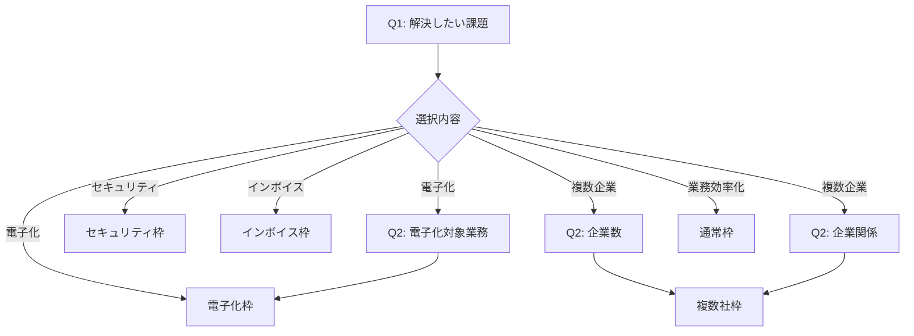

# IT導入補助金 質問票管理

## 📋 概要

このディレクトリはIT導入補助金2025専用の質問票を管理します。
申請者の回答に基づいて最適な申請枠を判定し、必要書類を自動的にフィルタリングします。

## 🗂️ ファイル構成

```
questionnaires/
├── README.md                    # このファイル
├── frame_selection.json         # 申請枠判定用質問票
└── (今後追加予定)
    ├── category_selection.json  # ITツールカテゴリー判定用
    └── eligibility_check.json   # 申請資格確認用
```

## 📊 質問票の構造

### frame_selection.json
IT導入補助金の5つの申請枠を判定するための質問票

**主要セクション：**
- `questions`: 質問と選択肢の定義
- `frame_determination_rules`: 各枠の判定ルールと必要書類
- `common_required_documents`: 全申請者共通の必須書類
- `category_documents`: ITツールカテゴリー別の必要書類

**申請枠：**
1. **通常枠** (tsujyo) - 一般的なIT導入
2. **電子化枠** (denshi) - 紙業務のデジタル化
3. **複数社枠** (fukusu) - 複数企業での共同申請
4. **インボイス枠** (invoice) - インボイス制度対応
5. **セキュリティ枠** (security) - セキュリティ対策

## 🔄 質問フロー



## 💻 実装例

```typescript
// 質問票の読み込み
import frameSelection from './frame_selection.json';

// 回答に基づく枠判定
function determineFrame(answers: AnswerSet): FrameResult {
  const mainAnswer = answers['q1_main_challenge'];
  const suggestedFrame = frameSelection.questions[0].options
    .find(opt => opt.value === mainAnswer)?.suggested_frame;
  
  // 必要書類の取得
  const frameRule = frameSelection.frame_determination_rules[suggestedFrame];
  const requiredDocs = [
    ...frameSelection.common_required_documents,
    ...frameRule.required_documents
  ];
  
  return {
    frame: frameRule.frame_name,
    requiredDocuments: requiredDocs,
    optionalDocuments: frameRule.optional_documents
  };
}
```

## 📈 効果

- **質問数削減**: 最大3問で申請枠を判定
- **書類の自動フィルタリング**: 30種類から必要な書類のみを表示
- **ミスの防止**: 申請枠に応じた正確な書類リストを提供

## 🔧 メンテナンス

質問票の更新時は以下を確認：
1. `version`を更新
2. 新しい申請枠が追加された場合は`frame_determination_rules`に追加
3. 書類名の変更は全ての参照箇所を更新
4. テストケースの追加・更新

## 📝 今後の拡張予定

- [ ] ITツールカテゴリー（5,6,7）自動判定
- [ ] 申請資格の事前チェック
- [ ] 補助率・上限額の自動計算
- [ ] 過去の申請履歴からの学習機能