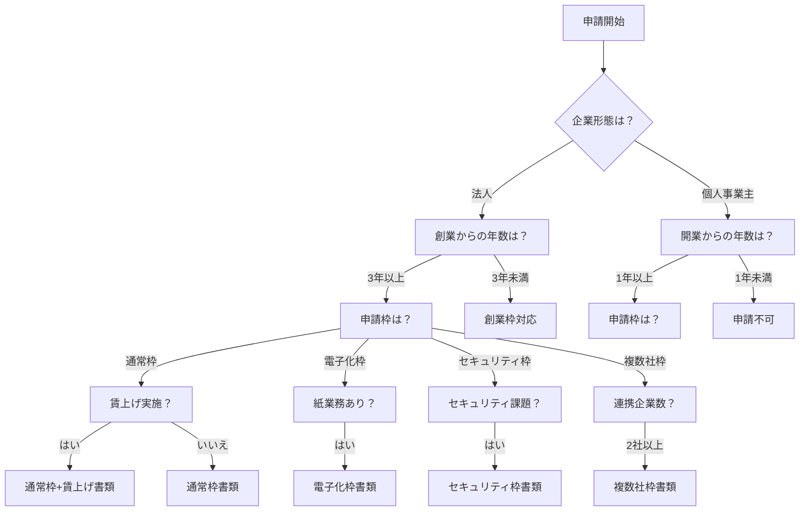
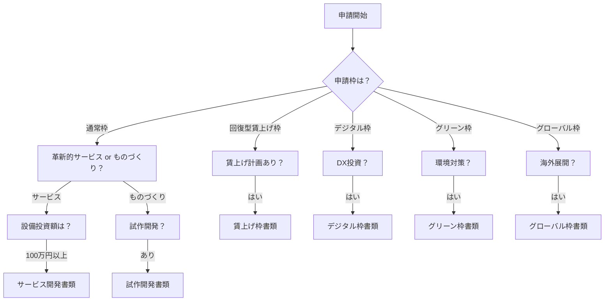
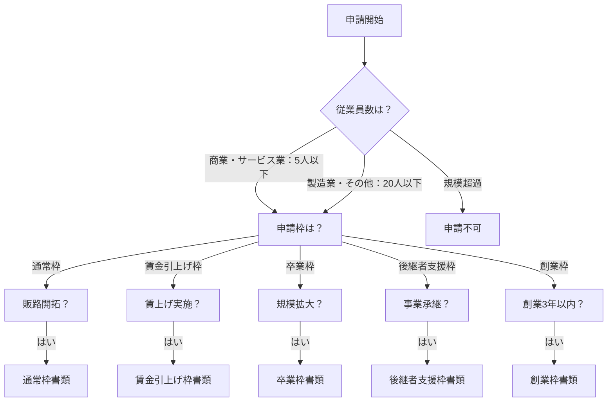

# 補助金別必要書類分岐表

## 1. IT導入補助金2025

### 分岐条件フロー

### 必要書類マトリクス

| 条件 | 必須書類 | 条件付き書類 |
|------|----------|--------------|
| **共通（全申請者）** | ・履歴事項全部証明書 ・納税証明書（その1,その2） ・決算書（直近2期分） ・労働者名簿 | - |
| **法人** | ・法人税確定申告書別表一 | ・役員名簿（みなし大企業確認用） |
| **個人事業主** | ・所得税確定申告書第一表 ・青色申告決算書 | ・開業届（1年未満の場合） |
| **通常枠** | ・実施計画書 ・ITツール情報 | ・賃金報告書（賃上げ加点） |
| **電子化枠** | ・電子化対象業務説明書 ・現状業務フロー図 | ・取引関係図 |
| **セキュリティ枠** | ・セキュリティ診断結果 ・対策計画書 | ・SECURITY ACTION宣言書 |
| **複数社枠** | ・連携体制説明書 ・各社の同意書 | ・幹事社証明書 |
| **創業3年未満** | ・創業計画書 | ・支援機関確認書 |

## 2. ものづくり補助金

### 分岐条件フロー

### 必要書類マトリクス

| 条件 | 必須書類 | 条件付き書類 |
|------|----------|--------------|
| **共通（全申請者）** | ・事業計画書 ・決算書（直近2期分） ・賃金台帳 ・労働者名簿 | ・認定支援機関確認書（3,000万円超） |
| **通常枠** | ・補助事業計画書 ・見積書（2社以上） | ・技術導入計画書（新技術の場合） |
| **回復型賃上げ枠** | ・賃上げ計画書（様式4） ・賃金台帳 | ・雇用計画書 |
| **デジタル枠** | ・DX推進計画書 ・デジタル技術活用説明書 | ・ITベンダー証明書 |
| **グリーン枠** | ・炭素生産性向上計画書 ・エネルギー使用量データ | ・環境認証書類 |
| **グローバル枠** | ・海外展開計画書 ・市場調査レポート | ・現地パートナー契約書 |
| **設備投資** | ・機械装置見積書 ・カタログ・仕様書 | ・設置場所の図面 |
| **試作開発** | ・開発計画書 ・技術的課題説明書 | ・特許関連書類 |

## 3. 小規模事業者持続化補助金

### 分岐条件フロー

### 必要書類マトリクス

| 条件 | 必須書類 | 条件付き書類 |
|------|----------|--------------|
| **共通（全申請者）** | ・様式1（申請書） ・様式2（経営計画書） ・様式3（補助事業計画書） ・確定申告書 | ・様式6（支援機関確認書） |
| **法人** | ・貸借対照表 ・損益計算書 | ・株主名簿（みなし大企業確認） |
| **個人事業主** | ・所得税青色申告決算書 または収支内訳書 | ・開業届（必要に応じて） |
| **通常枠** | ・見積書 ・カタログ等 | ・様式5（移住者の場合） |
| **賃金引上げ枠** | ・様式8（賃金引上げ枠申請書） ・賃金台帳 | ・労働保険料申告書 |
| **卒業枠** | ・卒業計画書 ・雇用拡大計画 | ・設備投資計画書 |
| **後継者支援枠** | ・様式9（事業承継診断票） ・後継者の経歴書 | ・事業承継計画書 |
| **創業枠** | ・様式7（創業支援証明書） ・創業計画書 | ・許認可証（該当業種） |

## 必要書類判定質問の設計

### 共通質問フロー
1. **企業形態の確認**
   - 質問: 「あなたの事業形態を選択してください」
   - 選択肢: 株式会社 / 合同会社 / 個人事業主 / NPO法人 / その他

2. **事業年数の確認**
   - 質問: 「創業・開業からの経過年数を選択してください」
   - 選択肢: 1年未満 / 1-3年 / 3-5年 / 5年以上

3. **従業員数の確認**
   - 質問: 「現在の従業員数（パート・アルバイト含む）を入力してください」
   - 入力: 数値入力

### 補助金別追加質問

#### IT導入補助金の場合
4. **申請枠の選択**
   - 質問: 「申請を検討している枠を選択してください」
   - 選択肢: 通常枠 / 電子化枠 / セキュリティ枠 / 複数社枠

5. **枠別条件確認**
   - 電子化枠: 「紙で行っている業務のデジタル化を計画していますか？」
   - セキュリティ枠: 「サイバーセキュリティ対策の強化を計画していますか？」
   - 複数社枠: 「他社と連携してITツールを導入しますか？」

#### ものづくり補助金の場合
4. **事業類型の選択**
   - 質問: 「実施する事業の類型を選択してください」
   - 選択肢: 革新的サービス開発 / 革新的ものづくり / 両方

5. **投資内容の確認**
   - 質問: 「主な投資内容を選択してください（複数選択可）」
   - 選択肢: 機械装置 / システム構築 / 技術導入 / 専門家活用

#### 持続化補助金の場合
4. **業種の確認**
   - 質問: 「主たる事業の業種を選択してください」
   - 選択肢: 商業・サービス業 / 製造業 / 建設業 / その他

5. **取組内容の確認**
   - 質問: 「実施予定の取組を選択してください（複数選択可）」
   - 選択肢: 新商品開発 / 販路開拓 / 業務効率化 / 事業承継