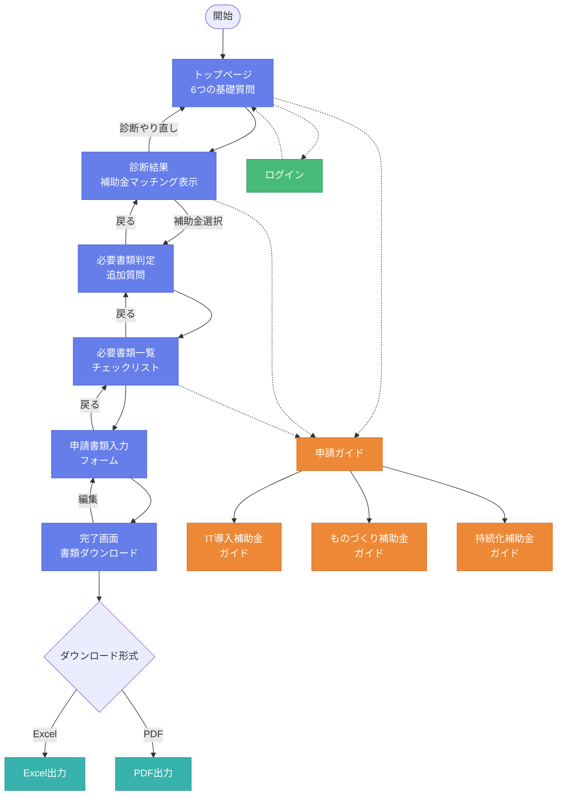

# IT補助金アシスタント - ページ一覧とフロー図

## 📑 ページ一覧

### 1. 基本フローページ

#### 1.1 トップページ (/)
- **コンポーネント**: `ModernSubsidyFlow`
- **目的**: 6つの基礎質問で補助金診断
- **内容**: 
  - 事業状況の確認
  - 経営課題の把握
  - 会社規模の確認
  - 業種の選択
  - 投資予算の確認
  - 開始時期の選択

#### 1.2 補助金マッチング結果 (/subsidy-results)
- **コンポーネント**: `SubsidyResults`
- **目的**: 診断結果の表示と補助金選択
- **内容**:
  - IT導入補助金、ものづくり補助金、持続化補助金のマッチ度表示
  - 各補助金の詳細情報（最大補助額、補助率、特徴）
  - 補助金の選択

#### 1.3 必要書類判定質問 (/document-requirements/:subsidyType)
- **コンポーネント**: `DocumentRequirementQuestions`
- **目的**: 選択した補助金の必要書類を判定
- **内容**:
  - 補助金別の詳細質問
  - 必要書類の判定ロジック
  - 申請要件の確認

#### 1.4 必要書類一覧 (/required-documents/:subsidyType)
- **コンポーネント**: `RequiredDocumentsList`
- **目的**: 必要書類の確認と準備状況チェック
- **内容**:
  - 必要書類のリスト表示
  - 書類の説明と準備方法
  - チェックリスト機能

#### 1.5 書類入力フォーム (/input-form/:subsidyType)
- **コンポーネント**: `DocumentInputForm`
- **目的**: 申請書類の情報入力
- **内容**:
  - 基本情報入力（会社名、代表者、連絡先等）
  - 補助金別の追加情報入力
  - バリデーション機能

#### 1.6 完了・書類出力画面 (/completion/:subsidyType)
- **コンポーネント**: `CompletionPage`
- **目的**: 入力内容確認と書類出力
- **内容**:
  - 入力内容のプレビュー
  - Excel/PDF形式でのダウンロード
  - 次のステップの案内

### 2. ガイドページ

#### 2.1 申請ガイド (/guide)
- **コンポーネント**: `ApplicationGuidePage`
- **目的**: 補助金申請の総合ガイド
- **内容**:
  - 申請の流れ
  - 各補助金の概要
  - よくある質問

#### 2.2 ものづくり補助金書類ガイド (/guide/monozukuri-documents)
- **コンポーネント**: `MonozukuriDocumentGuidePage`
- **目的**: ものづくり補助金の詳細ガイド
- **内容**:
  - 必要書類の詳細説明
  - 記入例とポイント
  - 申請スケジュール

#### 2.3 持続化補助金書類ガイド (/guide/jizokuka-documents)
- **コンポーネント**: `JizokukaDocumentGuidePage`
- **目的**: 持続化補助金の詳細ガイド
- **内容**:
  - 必要書類の詳細説明
  - 記入例とポイント
  - 申請スケジュール

#### 2.4 IT導入補助金書類ガイド (/guide/it-donyu-documents)
- **コンポーネント**: `ItDonyuDocumentGuidePage`
- **目的**: IT導入補助金の詳細ガイド
- **内容**:
  - 必要書類の詳細説明
  - 記入例とポイント
  - 申請スケジュール

### 3. その他のページ

#### 3.1 ログイン (/login)
- **コンポーネント**: `LoginPage`
- **目的**: ユーザー認証
- **内容**:
  - メールアドレスとパスワードでログイン
  - 申請データの保存・管理機能へのアクセス

#### 3.2 テスト完了ページ (/test-completion)
- **コンポーネント**: `TestCompletionPage`
- **目的**: 開発・デバッグ用のテストページ

### 4. 旧バージョンのページ（App.tsx）

以下は旧バージョン（App.tsx）で定義されているページです：

- **マイページ** (/mypage): 保存したプロジェクトの管理
- **進捗管理** (/dashboard): プロジェクトの進捗確認
- **ログインページ** (/login): ユーザー認証
- **サインアップページ** (/signup): 新規登録
- **検索ページ** (/search): 補助金検索
- **補助金詳細** (/subsidy/:id): 個別補助金の詳細表示

## 🔄 ユーザーフロー図



## 🎯 主要な画面遷移パターン

### 1. メインフロー（診断から申請書作成まで）
```
トップページ(/) 
→ 診断結果(/subsidy-results) 
→ 必要書類判定(/document-requirements/:subsidyType)
→ 必要書類一覧(/required-documents/:subsidyType)
→ 入力フォーム(/input-form/:subsidyType)
→ 完了画面(/completion/:subsidyType)
```

### 2. ガイド参照フロー
```
任意のページ 
→ 申請ガイド(/guide)
→ 各補助金詳細ガイド(/guide/[補助金名]-documents)
→ 元のページに戻る
```

### 3. ログインフロー
```
任意のページ
→ ログイン(/login)
→ トップページ(/)またはマイページ(/mypage)
```

## 📱 レスポンシブ対応

全てのページは以下の画面サイズに対応：
- **デスクトップ**: 1200px以上
- **タブレット**: 768px - 1199px
- **モバイル**: 767px以下

## 🔐 認証が必要なページ

- マイページ（/mypage）
- 進捗管理（/dashboard）
- プロジェクト保存機能

## 🎨 デザインシステム

- **カラーテーマ**: グラデーション（#667eea → #764ba2）
- **カード型UI**: モダンで見やすいカードレイアウト
- **アニメーション**: スムーズな画面遷移とマイクロインタラクション
- **プログレスバー**: 進捗状況の可視化