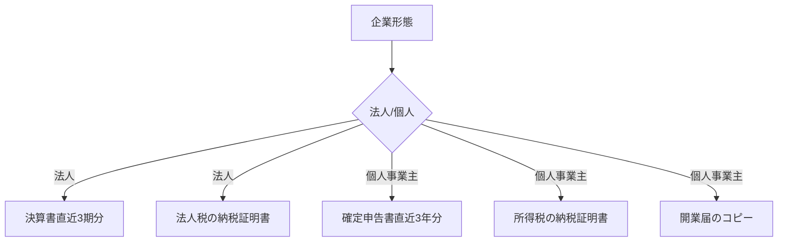
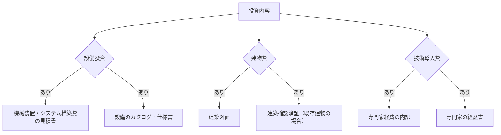
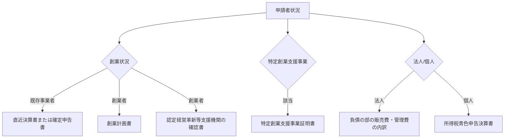

# 補助金別必要書類分岐表

## 📋 概要

本文書は、IT導入補助金、ものづくり補助金、小規模事業者持続化補助金のそれぞれにおいて、企業の状況や申請内容に応じて必要となる書類を整理した分岐表です。

---

## 💻 IT導入補助金2025

### 基本書類（全企業必須）

| 書類名 | 必須/条件付き | 備考 |
|--------|------------|------|
| gBizIDプライムアカウント | 必須 | 申請前に取得必要 |
| 履歴事項全部証明書 | 必須 | 3ヶ月以内のもの |
| 納税証明書 | 必須 | 未納がないこと |
| 事業計画書 | 必須 | 指定フォーマット |
| 導入ITツールの見積書 | 必須 | ITベンダー発行 |

### 条件別追加書類

#### 1. 企業形態による分岐

#### 2. 創業年数による分岐

| 創業年数 | 追加書類 | 代替書類 |
|----------|---------|----------|
| 3年未満 | 決算書が3期分ない場合 | 事業計画の詳細説明 |
| 1年未満 | 決算書がない場合 | 設立時事業計画書 |
| 創業前 | - | 創業計画書 |

#### 3. 申請枠による分岐

| 申請枠 | 追加書類 | 特記事項 |
|---------|---------|----------|
| 通常枠(A類型) | 特になし | - |
| デジタル化基盤導入枠(B類型) | 生産性向上計画 | 数値目標必須 |
| セキュリティ対策推進枠 | SECURITY ACTION宣言 | ★一つ星以上 |
| インボイス対応枠 | インボイス登録番号 | 適格請求書発行事業者 |

#### 4. 加点項目に関する書類

| 加点項目 | 追加書類 | 加点 |
|----------|---------|------|
| 地域未来牽引企業 | 認定証 | +5点 |
| クラウド利用 | クラウド利用計画書 | +3点 |
| サイバーセキュリティ保険 | 保険証券コピー | +3点 |

---

## 🏭 ものづくり補助金

### 基本書類（全企業必須）

| 書類名 | 必須/条件付き | 備考 |
|--------|------------|------|
| 事業計画書 | 必須 | 10〜15ページ程度 |
| 賣上高増加の根拠 | 必須 | 数値目標明記 |
| 決算書（直近2期分） | 必須 | 財務諸表一式 |
| 履歴事項全部証明書 | 必須 | 3ヶ月以内 |
| 納税証明書 | 必須 | 未納がないこと |

### 投資内容による分岐

### 申請枠種による分岐

#### 1. 一般型

| 条件 | 追加書類 |
|------|----------|
| 賃金引上げ特例 | 賃金引上げ計画書、従業員数証明 |
| 働き方改革推進 | 就業規則、労働時間管理資料 |

#### 2. グローバル展開型

| 条件 | 追加書類 |
|------|----------|
| 海外事業の準備 | 海外展開計画書 |
| ブランディング | ブランドコンセプト資料 |
| 市場調査 | 市場調査レポート |

#### 3. デジタル枠

| 条件 | 追加書類 |
|------|----------|
| DX推進 | DX推進計画書 |
| IoT活用 | IoTシステム構成図 |
| AI導入 | AI活用計画書 |

### 加点項目と追加書類

| 加点項目 | 必要書類 | 加点 |
|----------|---------|------|
| パートナーシップ構築 | 連携先との契約書 | +10点 |
| 経営力向上 | 経営計画書 | +5点 |
| 事業継続力強化 | BCP計画書 | +5点 |

---

## 🏪 小規模事業者持続化補助金

### 基本書類（全企業必須）

| 書類名 | 必須/条件付き | 備考 |
|--------|------------|------|
| 経営計画書 | 必須 | 様式2 |
| 補助事業計画書 | 必須 | 様式3 |
| 事業支援計画の写し | 必須 | 商工会等発行 |
| 履歴事項全部証明書 | 必須 | 3ヶ月以内 |

### 申請者の状況による分岐

### 申請枠による分岐

#### 1. 通常枠

| 条件 | 追加書類 |
|------|----------|
| 賃金引上げ特例 | 労働条件通知書、賃金台帳 |
| 卒業枠 | 雇用契約書、卒業証明書 |
| 後継者支援枠 | 後継者育成計画書 |

#### 2. 創業枠

| フェーズ | 必要書類 |
|----------|----------|
| 申請時 | 創業計画書、資金調達計画 |
| 採択後 | 開業届、設立登記事項証明書 |
| 実績報告 | 事業実施報告書、領収書 |

#### 3. 災害支援枠

| 災害種別 | 必要書類 |
|----------|----------|
| 自然災害 | 罹災証明書 |
| 感染症影響 | 売上減少証明書 |
| 事故等 | 事故報告書 |

### 経費区分と必要書類

| 経費区分 | 必要書類 | 注意事項 |
|----------|---------|----------|
| 機械装置等費 | 見積書・カタログ | 50万円以上は2社以上 |
| 広報費 | 広告媒体の資料 | 掲載予定証明 |
| ウェブサイト関連費 | サイト構成図 | ドメイン取得証明 |
| 展示会等出展費 | 出展申込書 | 会場図面 |
| 開発費 | 開発計画書 | 成果物イメージ |
| 資料購入費 | 購入予定リスト | 使用目的明記 |
| 雑役務費 | 業務委託契約書 | 作業内容明細 |
| 借料 | 賃貸借契約書 | 利用期間明記 |
| 専門家謝金 | 専門家経歴書 | 指導内容詳細 |
| 委託費 | 業務委託契約書 | 成果物説明 |
| 外注費 | 外注先情報 | 選定理由書 |

---

## 📢 共通的な注意事項

### 書類作成時のポイント

1. **有効期限**
   - 履歴事項全部証明書：3ヶ月以内
   - 納税証明書：3ヶ月以内
   - 見積書：6ヶ月以内が望ましい

2. **フォーマット**
   - 指定様式がある場合は必ず使用
   - 余白、フォントサイズに注意
   - PDF化時の文字化けに注意

3. **証明書類の取得**
   - 申請期限に余裕を持って取得
   - 複数部必要な場合あり
   - 原本提出が必要な場合に注意

### デジタル化対応

- 電子申請の場合、スキャンデータの品質に注意
- ファイルサイズ制限あり（通常10MB以下）
- ファイル名は日本語を避け、半角英数字を推奨

### チェックリスト

□ 必須書類がすべて揃っているか  
□ 有効期限内の書類か  
□ 企業名・住所等の記載が一致しているか  
□ 押印が必要な書類に押印されているか  
□ 指定様式を使用しているか  
□ 添付資料の番号・順番が整理されているか  
□ 電子データのファイル形式・サイズは適切か  

---

## 📌 クイックリファレンス

### 補助金別最低限必要書類

| 補助金 | 最低限必要書類数 | 特徴 |
|---------|----------------|------|
| IT導入補助金 | 5〜6種類 | デジタル化、簡素化傾向 |
| ものづくり補助金 | 8〜10種類 | 詳細な事業計画が必要 |
| 持続化補助金 | 6〜8種類 | 商工会等の支援が必須 |

### 申請時期による注意点

| 時期 | 注意事項 |
|------|----------|
| 公募開始直後 | システムが混雑、早めの準備 |
| 締切直前 | 書類不備のリスク大 |
| 年度末 | 決算書等の更新要注意 |