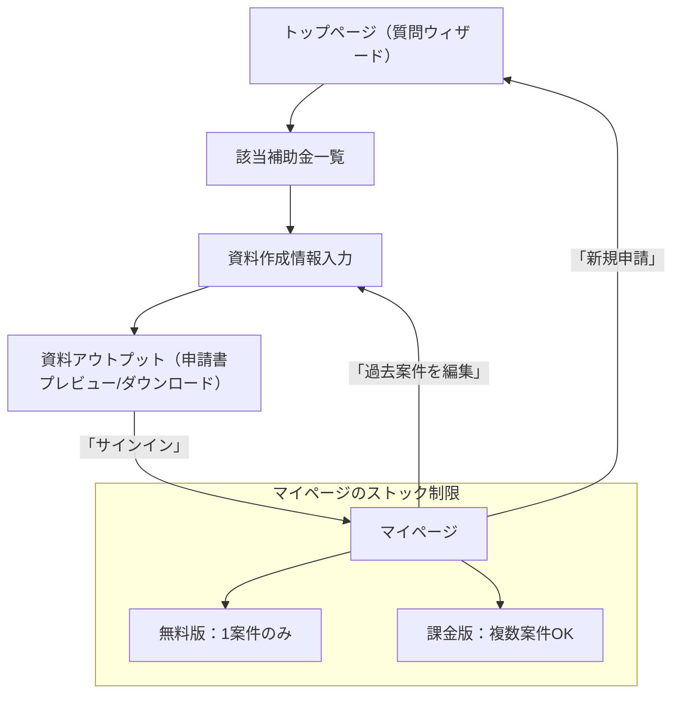

# IT補助金アシストツール サービス仕様書

---

## 1. サービス概要

- 中小企業向けのIT補助金検索・申請資料作成支援SaaS
- ウィザード形式の質問で最適な補助金を提案
- 申請書類の自動生成・ダウンロード機能
- サインインで情報ストック＆再利用（無料1件/有料複数）
- 進捗・品質・セキュリティをAIエージェントが分担管理

---

## 2. ユーザーフロー

1. **トップページ（質問ウィザード開始）**
   - アクセス時に5〜6問の質問から開始（ウィザード形式）
   - 初回は説明画面を表示後、診断開始ボタンで質問へ
2. **該当補助金の確認ページ**
   - 回答内容にマッチした補助金一覧を表示
   - 詳細を確認し、申請したい補助金を選択
3. **資料作成情報入力ページ**
   - 申請に必要な企業情報・事業計画などを入力
4. **資料アウトプットページ**
   - 入力内容をもとに申請書類を自動生成・プレビュー
   - ダウンロードや印刷が可能
5. **マイページ（ヘッダーからアクセス）**
   - ログイン/未ログインの状態をヘッダーに表示
   - 無料：1案件分ストック
   - 有料：複数案件ストック＆管理
   - 過去案件の再利用・編集が可能

---

## 3. エージェント構成

- **PRESIDENT**：全体統括・ビジョン提示
- **boss1**：チーム管理・進捗管理・指示出し
- **worker1**：フロントエンド/UI/UX（figma mcp・Playwright）
- **worker2**：バックエンド/データ処理（supabase mcp・jest）
- **worker3**：品質管理・セキュリティ・監査

---

## 4. 進捗管理・可視化

- 各エージェントの進捗ログ（`tmp/worker*_progress.log` など）を自動集約
- `progress/ALL_PROGRESS.md` で全員分の最新進捗を一覧表示
- スクリプト例：`scripts/aggregate_progress.sh` で進捗サマリー自動生成
- 必要に応じてHTML化や通知連携も可能

---

## 5. セキュリティ・運用

- GDPR/個人情報保護法/PCI DSS等の準拠
- API/DB/資料生成のセキュリティ監査・自動テスト
- CI/CDパイプライン・監査ログ・バックアップ運用

---

## 6. 料金プラン

- 無料版：1案件分ストック・申請書作成
- 有料版：複数案件ストック・高度な管理機能

---

## 7. 今後の拡張性

- 新たな補助金種別・テンプレート追加
- 他サービス連携（会計・労務等）
- AIによる自動アドバイス・最適化

---

## 8. 参考：画面遷移図

