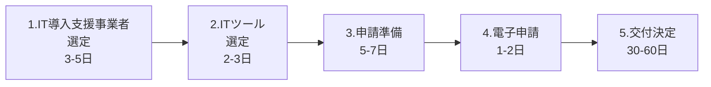
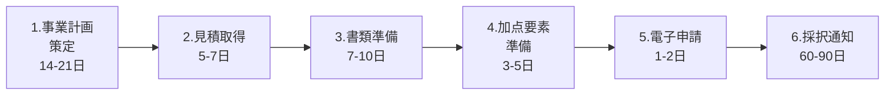
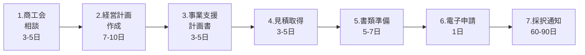

# 補助金申請プロセスガイド

## 🏢 IT導入補助金2025

### 📋 申請ステップ（全5ステップ）



### 📑 必要書類チェックリスト

| 書類名 | 取得場所 | 取得期間 | 備考 |
|--------|----------|----------|------|
| **履歴事項全部証明書** | 法務局 | 即日-3日 | 発行3ヶ月以内 |
| **納税証明書（その1,その2）** | 税務署 | 即日-1週間 | 直近のもの |
| **決算書（2期分）** | 自社保管 | - | 貸借対照表、損益計算書 |
| **gBizIDプライム** | オンライン | 2-3週間 | 事前取得必須 |

### 📅 申請スケジュール例（通常枠）

```
Day 1-5:   IT導入支援事業者の選定・相談
Day 6-8:   導入するITツールの選定・見積取得
Day 9-15:  申請書類の準備・作成
  - 実施内容説明書の作成
  - 価格説明書の作成
  - 事業計画の策定
Day 16-17: 電子申請（IT事業者ポータル）
Day 18-77: 審査期間（30-60日）
Day 78:    交付決定通知
```

### ⚠️ 重要ポイント
- IT導入支援事業者が主導して申請
- ITツールは事前登録されたものから選択
- 交付決定前の発注・契約・支払いは補助対象外

---

## 🔧 ものづくり補助金（第20次締切）

### 📋 申請ステップ（全6ステップ）



### 📑 必要書類チェックリスト

| 書類名 | 取得場所 | 取得期間 | 備考 |
|--------|----------|----------|------|
| **履歴事項全部証明書** | 法務局 | 即日-3日 | 発行3ヶ月以内 |
| **決算書（直近2期分）** | 自社保管 | - | 個人は確定申告書 |
| **見積書（相見積）** | 取引先 | 3-7日 | 50万円以上は相見積必須 |
| **建物の登記簿謄本** | 法務局 | 即日-3日 | 建物費を計上する場合 |
| **GビズIDプライム** | オンライン | 2-3週間 | 事前取得必須 |
| **労働者名簿** | 自社作成 | 1日 | 従業員数確認用 |

#### 加点要素書類（任意）
| 書類名 | 取得場所 | 取得期間 | 加点内容 |
|--------|----------|----------|----------|
| **事業継続力強化計画認定書** | 経済産業局 | 1-2ヶ月 | 加点要素 |
| **パートナーシップ構築宣言** | オンライン登録 | 即日 | 加点要素 |
| **賃上げ表明書** | 自社作成 | 1日 | 大幅賃上げで加点 |

### 📅 申請スケジュール例（通常枠）

```
Day 1-21:  事業計画書の作成
  - 具体的な事業内容の検討
  - 革新性の明確化
  - 収益計画の策定
Day 22-28: 設備・システムの見積取得
Day 29-38: 申請書類の準備
  - 事業計画書の最終化
  - CAGR算出ツールで数値計算
  - 添付書類の収集
Day 39-43: 加点要素の準備（任意）
Day 44-45: 電子申請（GビズID使用）
Day 46-135: 審査期間（60-90日）
Day 136:    採択発表
```

### ⚠️ 重要ポイント
- 事業計画書の革新性が最重要
- 付加価値額年率3%以上の向上が必須
- 交付決定後に発注・契約

---

## 🏪 小規模事業者持続化補助金（第17回）

### 📋 申請ステップ（全7ステップ）



### 📑 必要書類チェックリスト

#### 法人の場合
| 書類名 | 取得場所 | 取得期間 | 備考 |
|--------|----------|----------|------|
| **貸借対照表・損益計算書** | 自社保管 | - | 直近1期分 |
| **株主名簿** | 自社作成 | 1日 | 様式自由 |
| **履歴事項全部証明書** | 法務局 | 即日-3日 | 発行3ヶ月以内 |

#### 個人事業主の場合
| 書類名 | 取得場所 | 取得期間 | 備考 |
|--------|----------|----------|------|
| **確定申告書第一表・第二表** | 自己保管 | - | 直近分 |
| **収支内訳書または青色申告決算書** | 自己保管 | - | 直近分 |
| **開業届** | 税務署（控え） | - | 開業1年未満の場合 |

#### 共通必須書類
| 書類名 | 取得場所 | 取得期間 | 備考 |
|--------|----------|----------|------|
| **事業支援計画書** | 商工会/商工会議所 | 3-5日 | 発行に相談必須 |
| **見積書** | 取引先 | 3-7日 | 税抜10万円以上 |
| **GビズIDプライム** | オンライン | 2-3週間 | 電子申請に必須 |

#### 条件付き追加書類
| 書類名 | 取得場所 | 取得期間 | 条件 |
|--------|----------|----------|------|
| **事業承継診断票** | 自社作成 | 1日 | 代表者60歳以上 |
| **賃金台帳** | 自社保管 | - | 賃金引上げ枠 |
| **労働者名簿** | 自社保管 | - | 賃金引上げ枠 |

### 📅 申請スケジュール例（通常枠）

```
Day 1-5:   商工会/商工会議所への相談
  - 事業内容の説明
  - 補助対象経費の確認
  - 申請スケジュール調整
Day 6-15:  経営計画書・補助事業計画書の作成
  - 様式2: 経営計画書作成
  - 様式3: 補助事業計画書作成
  - 販路開拓の具体策検討
Day 16-20: 事業支援計画書の取得
  - 商工会/商工会議所で発行依頼
  - 計画内容の最終確認
Day 21-25: 見積書の取得
Day 26-32: その他必要書類の準備
Day 33:    電子申請（Jグランツ）
Day 34-123: 審査期間（60-90日）
Day 124:   採択発表
```

### ⚠️ 重要ポイント
- 商工会/商工会議所の支援が必須
- 従業員数制限（商業・サービス業5人以下、製造業等20人以下）
- 創業枠は専用様式を使用

---

## 📊 補助金別 申請期間比較

| 補助金 | 準備期間 | 審査期間 | 合計期間 |
|--------|----------|----------|----------|
| IT導入補助金 | 15-17日 | 30-60日 | 45-77日 |
| ものづくり補助金 | 44-45日 | 60-90日 | 104-135日 |
| 小規模事業者持続化補助金 | 33日 | 60-90日 | 93-123日 |

## 🚨 共通の注意事項

1. **GビズIDプライムは早めに取得**
   - 取得に2-3週間かかるため、最初に準備
   - 郵送での本人確認が必要

2. **交付決定前の発注は厳禁**
   - すべての補助金で共通
   - 事前着手申請制度がある場合のみ例外

3. **相見積りの準備**
   - 一定額以上は複数見積が必須
   - 仕様を統一して公平な比較

4. **申請期限の厳守**
   - 締切時刻を過ぎると一切受付不可
   - 余裕を持った申請を推奨