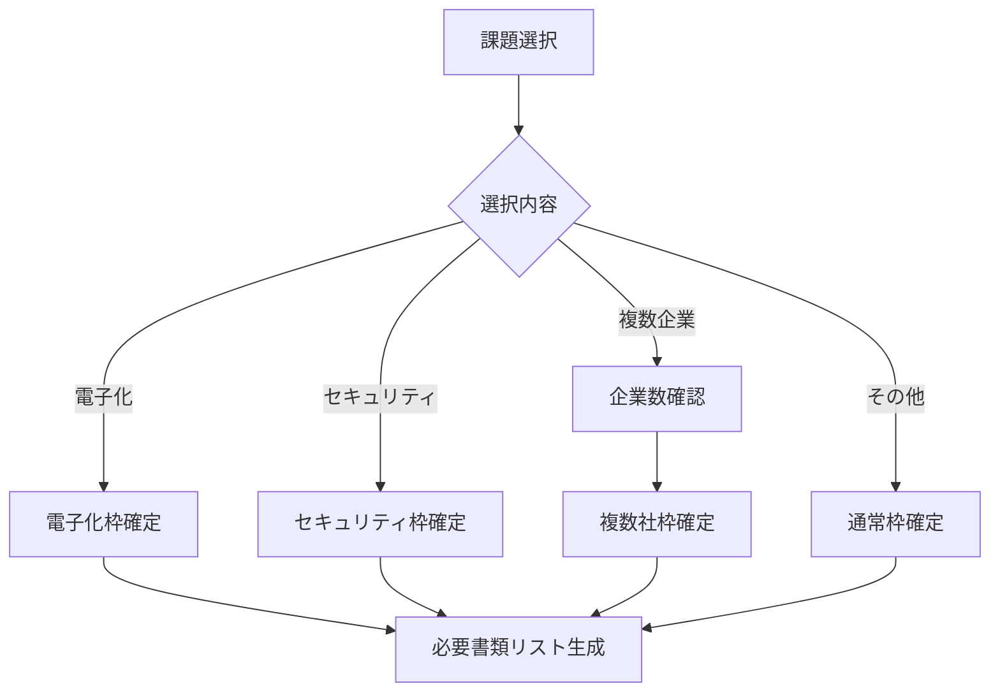

# IT導入補助金 分岐判定UI設計

## 🎯 最小の質問で最適な申請枠を判定

### Step 1: 基本的な申請意向の確認

```typescript
interface InitialQuestion {
  question: "どのような課題を解決したいですか？",
  type: "single-select",
  options: [
    {
      value: "digitalization",
      label: "📄 紙の業務をデジタル化したい",
      description: "請求書、契約書、受発注などの電子化",
      suggestedFrame: "電子化枠"
    },
    {
      value: "security",
      label: "🔒 セキュリティを強化したい",
      description: "サイバー攻撃対策、情報漏洩防止",
      suggestedFrame: "セキュリティ枠"
    },
    {
      value: "invoice",
      label: "📊 インボイス制度に対応したい",
      description: "適格請求書発行、経理業務効率化",
      suggestedFrame: "インボイス枠"
    },
    {
      value: "collaboration",
      label: "🤝 複数企業で共同導入したい",
      description: "グループ企業、取引先との連携",
      suggestedFrame: "複数社枠"
    },
    {
      value: "general",
      label: "💼 業務全般を効率化したい",
      description: "在庫管理、顧客管理、生産性向上など",
      suggestedFrame: "通常枠"
    }
  ]
}
```

### Step 2: 条件確認（選択に応じて動的表示）

#### 複数社枠を選んだ場合の追加質問
```typescript
interface MultiCompanyValidation {
  questions: [
    {
      id: "company_count",
      question: "何社で共同申請しますか？",
      type: "number-select",
      options: ["2社", "3社", "4社", "5社以上"],
      validation: "最低2社以上必要"
    },
    {
      id: "relationship",
      question: "申請企業間の関係を教えてください",
      type: "multi-select",
      options: [
        "グループ会社",
        "継続的な取引関係",
        "同一サプライチェーン",
        "共同事業の実施"
      ]
    }
  ]
}
```

#### 電子化枠を選んだ場合の追加質問
```typescript
interface DigitalizationValidation {
  questions: [
    {
      id: "target_process",
      question: "電子化したい業務を選択してください",
      type: "multi-select",
      options: [
        "受発注業務",
        "請求書発行",
        "契約書締結",
        "在庫管理",
        "その他帳票類"
      ],
      hint: "複数選択可能です"
    }
  ]
}
```

### Step 3: ITツールカテゴリーの自動判定

```typescript
interface ToolCategoryDetermination {
  // ユーザーには見せない内部判定
  logic: {
    if: "選択した課題と業務内容",
    then: "適切なカテゴリー（5,6,7）を自動判定",
    result: "必要な書類を自動でフィルタリング"
  }
}
```

## 📱 UI/UXデザイン案

### 1. ウィザード形式（推奨）
```
┌─────────────────────────────────────┐
│  IT導入補助金 申請枠診断           │
│                                     │
│  Q1. 解決したい課題は？             │
│                                     │
│  ◉ 📄 紙の業務をデジタル化したい   │
│  ○ 🔒 セキュリティを強化したい     │
│  ○ 📊 インボイス制度に対応したい   │
│  ○ 🤝 複数企業で共同導入したい     │
│  ○ 💼 業務全般を効率化したい       │
│                                     │
│         [次へ] →                    │
└─────────────────────────────────────┘
```

### 2. インタラクティブ診断
```typescript
// 選択結果のリアルタイム表示
interface RealtimeResult {
  recommendedFrame: "電子化枠",
  requiredDocuments: [
    "✅ 電子化枠公募要領",
    "✅ 取引関係書類（電子化枠）",
    "✅ カテゴリー別実施内容説明書"
  ],
  optionalDocuments: [
    "📝 賃金報告書（加点要素）"
  ]
}
```

### 3. スマートな絞り込み
```
最初の質問: 1問
　　↓
条件確認: 0〜2問（選択内容による）
　　↓
結果表示: 最適な申請枠と必要書類リスト
```

## 🎨 ビジュアルデザイン要素

### カード選択式UI
```
┌─────────────┐ ┌─────────────┐ ┌─────────────┐
│    📄       │ │    🔒       │ │    📊       │
│             │ │             │ │             │
│ 電子化枠    │ │セキュリティ枠│ │インボイス枠  │
│             │ │             │ │             │
│ 紙業務の    │ │ 情報漏洩    │ │ 制度対応    │
│デジタル化   │ │  対策      │ │  支援      │
└─────────────┘ └─────────────┘ └─────────────┘
```

### プログレスバー
```
申請枠選択 ━━━━━━━━━━ 40%
　　↓
条件確認  ━━━━━━━━━━━━━━━━ 70%
　　↓
書類確認  ━━━━━━━━━━━━━━━━━━━━ 100%
```

## 💡 実装のポイント

1. **質問の最小化**
   - 最初の1問で大まかな方向性を決定
   - 追加質問は必要最小限に

2. **視覚的な分かりやすさ**
   - アイコンと色で直感的に理解
   - 選択肢に説明文を付加

3. **即座のフィードバック**
   - 選択と同時に必要書類を表示
   - 不要な書類は非表示に

4. **保存と再開**
   - 途中の選択状態を保存
   - いつでも選択をやり直し可能

## 🔄 フロー例



この設計により、最大3クリックで申請枠と必要書類が確定します。