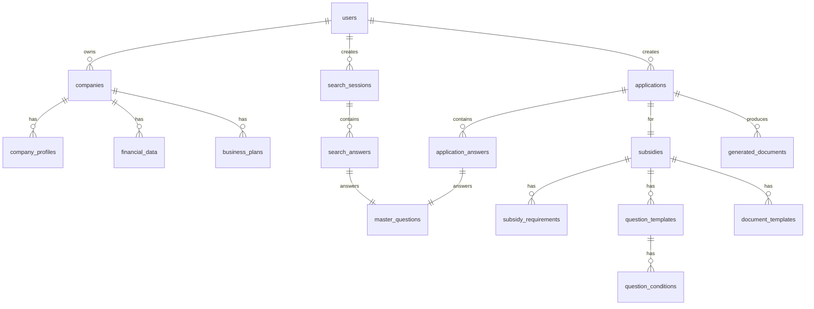
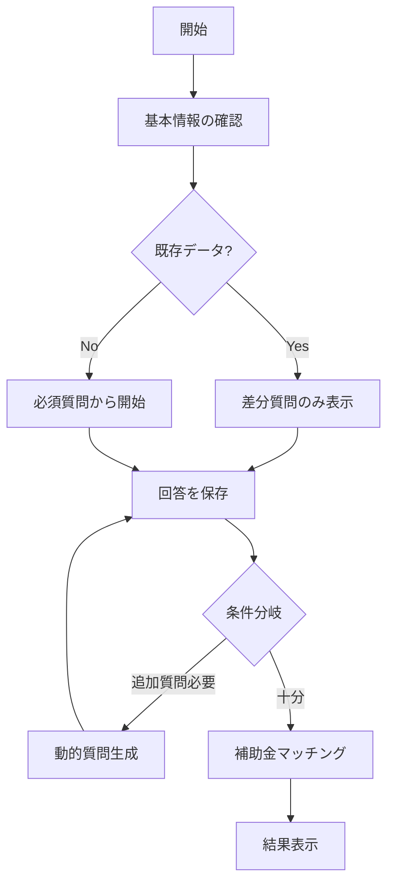
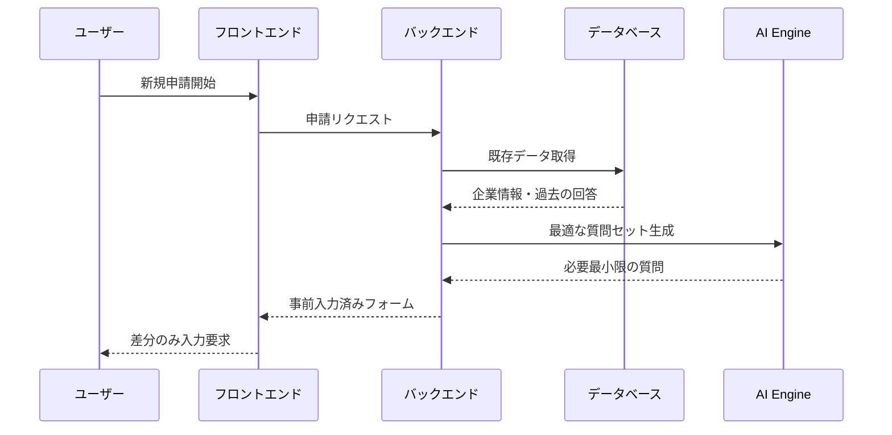

# IT補助金アシストツール システム設計書

## 1. 設計コンセプト

### 基本理念
「**最小の入力工数で最大の成果**」を実現するスマートな補助金申請支援システム

### 3つの核心機能
1. **スマート質問システム** - AIが最適な質問を動的に生成し、重複入力を排除
2. **情報の再利用と学習** - 一度入力した情報は自動的に他の申請でも活用
3. **自動書類生成** - 入力情報から各補助金の申請書類を自動生成

---

## 2. データベース設計

### 2.1 エンティティ関係図



### 2.2 主要テーブル設計

#### 1. **master_questions** (マスター質問テーブル)
```sql
CREATE TABLE master_questions (
    id UUID PRIMARY KEY,
    question_code VARCHAR(50) UNIQUE, -- 例: COMPANY_NAME, EMPLOYEE_COUNT
    question_text TEXT,
    input_type VARCHAR(20), -- text, number, select, date, etc.
    validation_rules JSONB,
    category VARCHAR(50), -- company_info, financial, business_plan, etc.
    is_reusable BOOLEAN DEFAULT true,
    created_at TIMESTAMP
);
```

#### 2. **companies** (企業基本情報)
```sql
CREATE TABLE companies (
    id UUID PRIMARY KEY,
    user_id UUID REFERENCES users(id),
    master_data JSONB, -- 全ての基本情報を格納
    created_at TIMESTAMP,
    updated_at TIMESTAMP
);

-- master_dataの構造例:
{
  "COMPANY_NAME": "株式会社サンプル",
  "EMPLOYEE_COUNT": 50,
  "ESTABLISHED_DATE": "2010-04-01",
  "CAPITAL": 10000000,
  "INDUSTRY": "IT",
  "ADDRESS": {...},
  ...
}
```

#### 3. **subsidies** (補助金マスター)
```sql
CREATE TABLE subsidies (
    id UUID PRIMARY KEY,
    name VARCHAR(255),
    code VARCHAR(50) UNIQUE,
    description TEXT,
    max_amount BIGINT,
    subsidy_rate DECIMAL(3,2),
    application_period JSONB,
    eligibility_rules JSONB, -- 申請資格の条件式
    required_documents JSONB,
    is_active BOOLEAN DEFAULT true
);
```

#### 4. **search_sessions** (検索セッション)
```sql
CREATE TABLE search_sessions (
    id UUID PRIMARY KEY,
    user_id UUID REFERENCES users(id),
    company_id UUID REFERENCES companies(id),
    matched_subsidies JSONB[], -- マッチした補助金のリスト
    completed_at TIMESTAMP,
    created_at TIMESTAMP
);
```

#### 5. **smart_questions** (動的質問管理)
```sql
CREATE TABLE smart_questions (
    id UUID PRIMARY KEY,
    subsidy_id UUID REFERENCES subsidies(id),
    master_question_id UUID REFERENCES master_questions(id),
    priority INTEGER, -- 質問の優先度
    conditions JSONB, -- この質問を表示する条件
    dependencies JSONB -- 他の質問への依存関係
);
```

---

## 3. 機能設計

### 3.1 スマート質問システム

#### 基本フロー


#### 質問の最適化アルゴリズム
1. **既存データの活用**: ユーザーの過去の回答を自動入力
2. **条件付き質問**: 前の回答に基づいて必要な質問のみ表示
3. **一括回答**: 関連する質問をグループ化して効率化

### 3.2 資料作成UI

#### インテリジェントフォーム
```typescript
interface SmartForm {
  // 自動入力された既存データ
  prefilledData: Record<string, any>;
  
  // この補助金特有の追加質問
  additionalQuestions: Question[];
  
  // AIによる入力支援
  aiSuggestions: {
    field: string;
    suggestion: string;
    confidence: number;
  }[];
  
  // 進捗状況
  completionStatus: {
    required: number;
    completed: number;
    optional: number;
  };
}
```

### 3.3 書類自動生成システム

#### テンプレートエンジン
```typescript
interface DocumentTemplate {
  id: string;
  subsidyId: string;
  format: 'pdf' | 'excel' | 'word';
  template: {
    sections: Section[];
    mappings: FieldMapping[]; // 質問IDと書類フィールドのマッピング
  };
}

interface FieldMapping {
  documentField: string;
  questionId: string;
  transformer?: (value: any) => any; // データ変換関数
}
```

---

## 4. API設計

### 4.1 エンドポイント一覧

#### 検索・マッチング
- `POST /api/v1/subsidy-search/start` - 検索セッション開始
- `POST /api/v1/subsidy-search/answer` - 質問への回答
- `GET /api/v1/subsidy-search/next-question` - 次の質問を取得
- `GET /api/v1/subsidy-search/results` - マッチング結果

#### 申請書類作成
- `POST /api/v1/applications/create` - 申請作成
- `GET /api/v1/applications/:id/questions` - 必要な質問を取得
- `POST /api/v1/applications/:id/answers` - 回答を保存
- `POST /api/v1/applications/:id/generate-documents` - 書類生成

#### 企業情報管理
- `GET /api/v1/company/profile` - 企業情報取得
- `PUT /api/v1/company/profile` - 企業情報更新
- `GET /api/v1/company/reusable-data` - 再利用可能なデータ取得

---

## 5. データフロー設計

### 5.1 情報の再利用フロー



### 5.2 学習システム

```typescript
interface LearningSystem {
  // 回答パターンの学習
  analyzeAnswerPatterns(userId: string): AnswerPattern[];
  
  // 質問の最適化
  optimizeQuestionOrder(subsidyId: string, userProfile: UserProfile): Question[];
  
  // 入力予測
  predictAnswer(questionId: string, context: AnswerContext): PredictedAnswer;
}
```

---

## 6. 実装優先順位

### Phase 1: MVP（1-2ヶ月）
1. ✅ 基本的なログイン・認証
2. 🔄 企業基本情報の登録・編集
3. 🔄 シンプルな補助金検索（固定質問）
4. 🔄 基本的な書類生成（PDFエクスポート）

### Phase 2: スマート機能（2-3ヶ月）
1. 動的質問システム
2. 情報の自動入力・再利用
3. 複数補助金の比較機能
4. 書類テンプレートの拡充

### Phase 3: AI統合（3-4ヶ月）
1. AI による入力支援
2. 自動文章生成
3. 申請成功率の予測
4. パーソナライズされた推薦

---

## 7. 技術スタック（推奨）

### バックエンド
- **API**: Node.js + Express + TypeScript
- **データベース**: PostgreSQL (Supabase)
- **AI Integration**: OpenAI API / Claude API
- **ドキュメント生成**: PDFKit, ExcelJS

### フロントエンド
- **フレームワーク**: React + TypeScript
- **状態管理**: TanStack Query + Zustand
- **UI**: 既存のデザインシステムを拡張
- **フォーム**: React Hook Form + Zod

### インフラ
- **ホスティング**: Vercel (Frontend) + Supabase (Backend)
- **ストレージ**: Supabase Storage
- **CDN**: Cloudflare

---

## 8. セキュリティ考慮事項

1. **データ暗号化**: 企業の機密情報は全て暗号化
2. **アクセス制御**: ロールベースアクセス制御（RBAC）
3. **監査ログ**: 全ての操作を記録
4. **データ保持**: GDPRに準拠した保持ポリシー

---

## 9. 次のステップ

1. **データベーススキーマの詳細設計**
2. **APIの詳細仕様書作成**
3. **UIワイヤーフレーム作成**
4. **開発タスクの細分化**