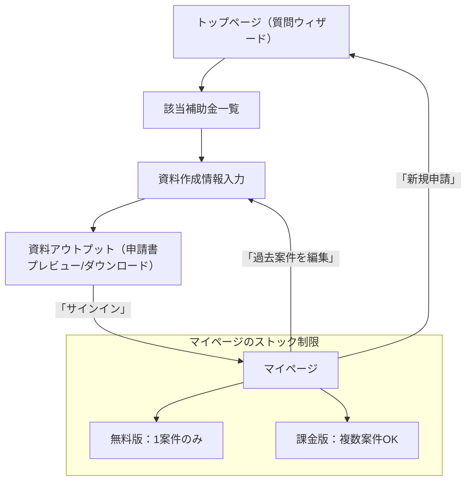

# IT補助金アシストツール 新ユーザーフロー・設計

## 1通りの流れ

1. **トップページ**
   - 5〜6問の質問に回答（ウィザード形式）
2. **該当補助金の確認ページ**
   - 回答内容にマッチした補助金一覧を表示
   - 詳細を確認し、申請したい補助金を選択
3. **資料作成情報入力ページ**
   - 申請に必要な企業情報・事業計画などを入力
4. **資料アウトプットページ**
   - 入力内容をもとに申請書類を自動生成・プレビュー
   - ダウンロードや印刷が可能

## サインイン・マイページ機能
- サインインすると、入力した情報がユーザーログとして保存される
- 無料版：マイページには「1案件分」の情報のみストック可能
- 課金版：マイページで「複数案件」の補助金申請情報をストック＆管理できる
- 次回以降、過去の入力情報を呼び出して再利用できる

## 画面遷移図（Mermaid記法）

## 補足
- 「pj_hojo」の資料アウトプット内容を踏襲
- サインイン状態でのみストック＆再利用が可能
- マイページから新規申請・過去案件編集ができる 