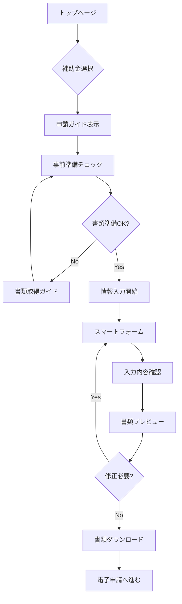

# 補助金Web申請システム フロー設計

## 🎯 システムコンセプト

**「補助金申請書類をWeb上で完結」**
- 必要な質問に答えるだけで正式書類を自動生成
- 各役所への書類取得ガイド付き
- 申請スケジュールの可視化

---

## 📱 画面フロー

### 1. トップページ
```
┌─────────────────────────────────────┐
│      補助金申請アシスタント         │
│                                     │
│  [IT導入補助金]  [ものづくり]  [持続化]  │
│                                     │
│    最小の入力で最大の成果を         │
└─────────────────────────────────────┘
```

### 2. 補助金選択後の画面構成

```
┌─────────────────────────────────────┐
│  IT導入補助金2025                   │
├─────────────────────────────────────┤
│ ■ 申請ステップ  ■ 必要書類  ■ スケジュール │
├─────────────────────────────────────┤
│                                     │
│  現在のステップ: 1/5                │
│  [===----------] 20%                │
│                                     │
│  次の書類を準備してください:        │
│  ☐ 履歴事項全部証明書（法務局）     │
│  ☐ 納税証明書（税務署）            │
│  ☐ GビズIDプライム（オンライン）    │
│                                     │
│        [申請を開始する]             │
└─────────────────────────────────────┘
```

---

## 🔄 申請フロー詳細

### Phase 1: 事前準備チェック

#### 画面: 申請資格確認
```typescript
interface EligibilityCheck {
  questions: [
    {
      id: 'business_type',
      question: '事業形態を選択してください',
      options: ['株式会社', '有限会社', '個人事業主', 'NPO法人', 'その他']
    },
    {
      id: 'employee_count',
      question: '従業員数を教えてください',
      type: 'number',
      validation: (value) => value >= 0
    },
    {
      id: 'industry',
      question: '主要な業種を選択してください',
      options: ['製造業', 'サービス業', '小売業', 'IT・情報通信業', ...]
    }
  ]
}
```

#### 画面: 必要書類チェックリスト
```typescript
interface DocumentChecklist {
  required: [
    {
      name: '履歴事項全部証明書',
      location: '法務局',
      obtainMethod: 'オンライン申請可（登記ねっと）',
      fee: '600円',
      time: '即日〜3営業日',
      link: 'https://www.touki-kyoutaku-online.moj.go.jp/',
      checked: false
    },
    // ... 他の書類
  ],
  getDaysUntilDeadline: () => number,
  showAlert: boolean
}
```

### Phase 2: 情報入力

#### 画面: スマートフォーム
```typescript
interface SmartForm {
  // 既存データから自動入力
  autoFillFromPreviousApplications: boolean,
  
  sections: [
    {
      title: '企業基本情報',
      fields: [
        { name: 'companyName', value: '株式会社サンプル', source: 'previous' },
        { name: 'address', value: '', required: true },
        // ...
      ]
    },
    {
      title: '事業計画',
      fields: [
        { 
          name: 'businessPlan',
          type: 'textarea',
          aiAssist: true, // AI入力支援
          template: 'it-implementation-plan'
        }
      ]
    }
  ],
  
  // 入力進捗の保存
  autoSave: true,
  saveInterval: 30 // 秒
}
```

### Phase 3: 書類生成

#### 画面: プレビュー & 編集
```typescript
interface DocumentPreview {
  documents: [
    {
      type: '様式1_申請書',
      format: 'docx',
      preview: 'pdf',
      editable: true,
      fields: {
        申請日: '2025年6月19日',
        申請者名: '株式会社サンプル',
        // ... 自動入力された内容
      }
    }
  ],
  
  actions: {
    edit: () => void,
    download: (format: 'pdf' | 'docx' | 'xlsx') => void,
    print: () => void
  }
}
```

---

## 📊 UI/UXデザイン要素

### 1. プログレスインジケーター
```
申請準備 ━━━━━━━━━━ 100% ✓
書類収集 ━━━━━━━━━━  80% 
情報入力 ━━━━        40%
書類確認 ----        0%
申請完了 ----        0%
```

### 2. 書類取得ガイド（モーダル表示）
```
┌─────────────────────────────────────┐
│  履歴事項全部証明書の取得方法       │
├─────────────────────────────────────┤
│                                     │
│  📍 取得場所：最寄りの法務局        │
│                                     │
│  💻 オンライン申請も可能：          │
│     登記ねっと                      │
│     [サイトを開く]                  │
│                                     │
│  💰 手数料：600円                   │
│  ⏱️ 所要時間：即日〜3営業日         │
│                                     │
│  📝 必要なもの：                    │
│     - 印鑑                          │
│     - 本人確認書類                  │
│                                     │
│  [地図で法務局を探す] [閉じる]      │
└─────────────────────────────────────┘
```

### 3. スケジュールビュー
```
2025年6月
│
├─ 19日（今日）申請準備開始
├─ 22日 商工会相談予約
├─ 26日 ★書類収集完了予定
├─ 30日 申請書作成
│
7月
├─ 5日  ★電子申請期限
├─ 10日 審査開始
│
8月
├─ 30日 採択発表予定
```

### 4. リアルタイムバリデーション
```typescript
// 入力値の即時チェック
const ValidationRules = {
  employeeCount: {
    jizokuka: (value) => {
      if (業種 === 'サービス業' && value > 5) {
        return { valid: false, message: '小規模事業者の要件を満たしていません' }
      }
    }
  },
  capitalAmount: {
    monozukuri: (value) => {
      if (value > 300000000) {
        return { valid: false, message: '中小企業の要件を超えています' }
      }
    }
  }
}
```

---

## 🎨 画面遷移図



---

## 💾 データ管理

### 1. 入力データの保存
```typescript
interface ApplicationData {
  userId: string,
  subsidyType: string,
  status: 'draft' | 'completed' | 'submitted',
  lastUpdated: Date,
  data: {
    company: CompanyInfo,
    project: ProjectInfo,
    documents: DocumentInfo[],
    answers: QuestionAnswers
  },
  // 他の補助金申請でも再利用
  reusableFields: string[]
}
```

### 2. 書類テンプレート管理
```typescript
interface DocumentTemplate {
  subsidyType: string,
  documentType: string,
  version: string,
  fields: FieldDefinition[],
  mappings: {
    // フォーム入力値から書類フィールドへのマッピング
    formField: string,
    documentField: string,
    transformer?: (value: any) => any
  }[]
}
```

---

## 🚀 実装優先順位

### Phase 1（MVP）
1. 補助金選択画面
2. 申請ステップ・必要書類表示
3. 基本的な入力フォーム
4. 書類プレビュー（PDF表示）

### Phase 2
1. スマート入力支援
2. 書類自動生成
3. 進捗管理機能
4. データ再利用機能

### Phase 3
1. AI入力アシスタント
2. 書類取得予約連携
3. 電子申請システム連携
4. 申請後のフォローアップ